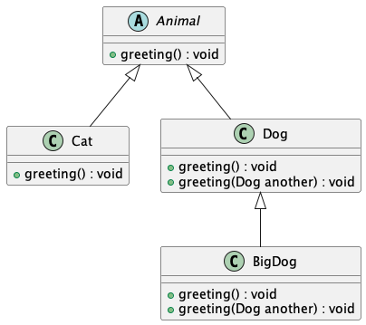

# UML Diagram for Animal Hierarchy

## Description of the Animal Hierarchy

The `TestAnimal` class demonstrates the concept of polymorphism by using the `greeting()` method on `Animal` references that point to different subclasses (`Cat`, `Dog`, and `BigDog`). Each subclass provides its own implementation of the `greeting()` method, resulting in specific outputs such as "Meow!" for `Cat`, "Woof!" for `Dog`, and "Woow!" for `BigDog`.

### Class Structure Overview

- **Animal (Abstract Class)**: The base class, `Animal`, is defined as abstract and contains the abstract method `greeting()`. This method is meant to be implemented by all subclasses, and it cannot be instantiated directly.

- **Cat (Subclass of Animal)**: The `Cat` class extends `Animal` and provides its own implementation of the `greeting()` method, which outputs "Meow!".

- **Dog (Subclass of Animal)**: The `Dog` class also extends `Animal` and overrides the `greeting()` method to output "Woof!". Additionally, it has an overloaded method `greeting(Dog another)` that outputs "Woooooooooof!" when greeting another `Dog`.

- **BigDog (Subclass of Dog)**: The `BigDog` class is a subclass of `Dog` and overrides both the `greeting()` method to output "Woow!" and the overloaded `greeting(Dog another)` method to output "Woooooowwwww!" when greeting another `Dog`.

### Explanation of Key Concepts

- **Polymorphism**: Polymorphism is demonstrated by using `Animal` references (`animal1`, `animal2`, `animal3`) that point to different subclass instances (`Cat`, `Dog`, `BigDog`). The appropriate `greeting()` method is called based on the actual type of the object, not the reference type, resulting in different outputs for each subclass.

- **Abstract Class Instantiation Error**: Attempting to instantiate the `Animal` class directly (`Animal animal4 = new Animal();`) results in a compilation error because `Animal` is abstract and cannot be instantiated.

- **Downcasting**: Downcasting is used to access subclass-specific methods. For example, `Dog dog2 = (Dog) animal2;` successfully downcasts an `Animal` reference to a `Dog` object, allowing access to `Dog`-specific methods. However, incorrect downcasting, such as `Cat cat2 = (Cat) animal2;`, results in a `ClassCastException` at runtime because `animal2` is actually a `Dog` and cannot be cast to `Cat`.

- **Method Overloading**: The `Dog` and `BigDog` classes include an overloaded version of the `greeting()` method that takes another `Dog` as a parameter. This showcases polymorphism with method overloading, where `Dog` outputs "Woooooooooof!" and `BigDog` outputs "Woooooowwwww!" depending on whether the calling object is a `Dog` or `BigDog` instance.

### Summary

The `Animal` hierarchy effectively demonstrates polymorphism, method overriding, and downcasting. The abstract `Animal` class provides a common interface for its subclasses, which implement their own versions of the `greeting()` method. The use of polymorphism allows for flexible code where an `Animal` reference can point to different subclass objects, and downcasting enables subclass-specific behavior to be accessed. Method overloading in `Dog` and `BigDog` further enriches the dynamic behavior of the hierarchy.

